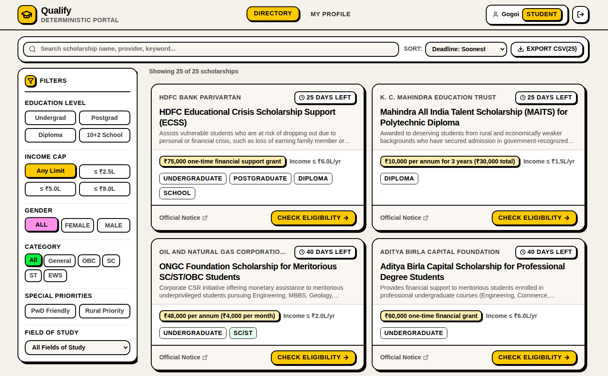

# Qualify — Scholarship Eligibility Portal

A simple, transparent portal that helps students quickly find scholarships they qualify for, understand required documents, and track application deadlines without reading through dense PDF notices.

---

## 📌 Problem

- **Lengthy circulars:** Official scholarship notices are often 20+ pages of dense legal text.
- **Confusion over eligibility:** Students struggle to know if their marks, income, category, or course match the rules.
- **Hidden rejection reasons:** Most portals give a yes/no answer without explaining *why* a student was rejected.
- **Missed deadlines & missing documents:** Students frequently miss cutoffs or forget essential paperwork.

---

## 💡 Solution

**Qualify** compares a student's profile against clear, recorded scholarship rules. It gives an immediate verdict (`Eligible`, `Possibly Eligible`, or `Not Eligible`) along with an exact, itemized reason for every single rule.

- **100% Transparent:** No black-box scoring or hidden algorithms. Every evaluated rule is shown with your actual profile value vs. the required value.
- **No File Uploads Needed:** Students do not need to upload personal documents; they simply maintain a preparation checklist.
- **Always Links to Source:** Every listing provides a direct link to the original official circular for final confirmation.

---

## 📸 Screenshots



<br/>


---

## ✨ Key Features

### For Students
- **Smart Profile:** Save basic academic, financial, and demographic details once.
- **Instant Eligibility Verdicts:**
  - 🟢 **Eligible:** You meet all mandatory requirements.
  - 🟡 **Possibly Eligible:** You meet the known requirements, but some profile information is missing (e.g. specific category or area type).
  - 🔴 **Not Eligible:** You do not meet one or more mandatory rules (with the exact reason explained).
- **Interactive Document Checklist:** Check off required documents (e.g., Income Certificate, Marksheet) as you gather them.
- **Deadline Tracking:** Clear countdown tags showing days remaining until closure.
- **Search & Filter:** Filter by field of study, education level, max family income, gender, or social category.
- **Export Directory (CSV):** Download the full list of scholarships and requirements in one click.

### For Administrators / Institutions
- **Add & Manage Scholarships:** Enter title, provider, benefits, deadline, and official circular link.
- **Visual Rule Builder:** Define precise eligibility criteria without coding (e.g. `Family Income <= ₹5,00,000`, `CGPA >= 7.5`).
- **Required Documents Manager:** Specify mandatory and optional documents needed from applicants.

---

## 🔄 How It Works

1. **Admin lists a scholarship:** Defines criteria (income limits, academic scores, eligible courses) and lists required documents.
2. **Student creates a profile:** Enters education level, course, CGPA, annual family income, state, and category.
3. **Deterministic evaluation:** The engine compares student details against each rule:
   - Evaluates operators: `=`, `!=`, `<=`, `>=`, `IN`, `CONTAINS`.
   - Flags missing data as `UNKNOWN` instead of guessing.
4. **Transparent breakdown:** The student sees exactly which rules passed, which failed, and why.
5. **Preparation & verification:** The student checks off required documents and clicks the official notice link to submit their application on the official portal.

---

## 🛠️ Tech Stack

- **Frontend:** Next.js 14 (App Router), TypeScript, Tailwind CSS, Lucide Icons
- **Backend:** Hono framework running on Cloudflare Workers (Edge API)
- **Database:** Cloudflare D1 (Serverless SQLite)
- **Authentication:** Stateless JWT with role-based access (`student`, `admin`)
- **Deployment:** Cloudflare Workers (API) + Cloudflare Pages (Frontend)

---

## 🔑 Demo Accounts

Use these preloaded credentials to test the platform immediately:

| Role | Email | Password | Details |
| :--- | :--- | :--- | :--- |
| **Admin** | `admin@scholarships.gov.in` | `Admin@12345` | Can add, edit, and delete scholarships and rules |
| **Student (Complete)** | `student1@test.com` | `Student@12345` | Full profile ready for instant eligibility check |
| **Student (New)** | `student2@test.com` | `Student@12345` | Incomplete profile to test profile setup flow |

---

## 🚀 Getting Started

### Prerequisites
- Node.js 18+
- npm

### 1. Backend Setup
```bash
cd backend
npm install

# Initialize local database and load seed scholarships
npm run db:setup

# Start local backend server (runs at http://localhost:8787)
npm run dev
```

### 2. Frontend Setup
```bash
cd frontend
npm install

# Start frontend development server (open http://localhost:3000)
npm run dev
```

Open [http://localhost:3000](http://localhost:3000) in your browser to view the app.

---

## ⚠️ Important Disclaimers

1. **Informational tool only:** This portal evaluates eligibility based on visible rules. It does not submit official applications and cannot guarantee official selection.
2. **Verify with original notice:** Scholarship terms can change. Always confirm details using the provided official notice link before applying.
3. **Transparent logic:** No AI models or black-box scores make eligibility decisions. All checks are strictly rule-based and visible to the user.
